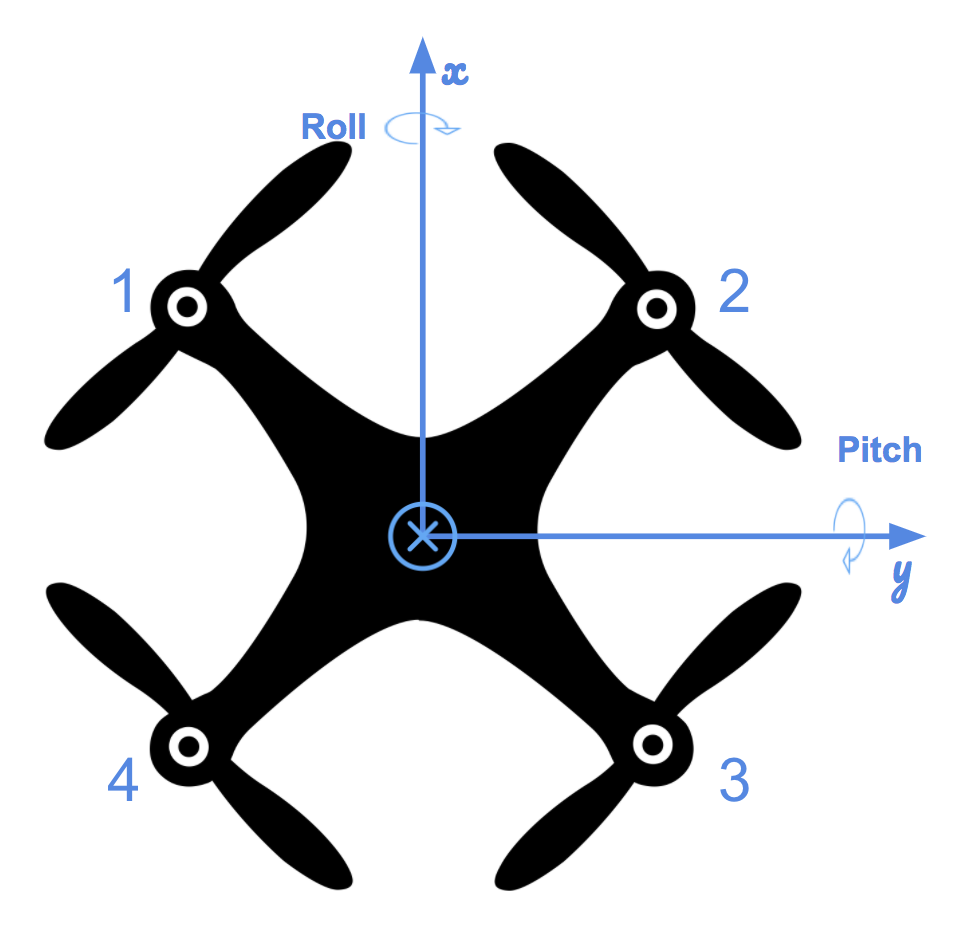

# Control of a 3D Quadrotor

Cascaded PID controls are implemented in this project to control a quadrotor.  The overall system of control is shown below.  In the figures below, PD controller is required when output from a control block is a second derivative of the input (second order system).  When zooming into the attitude controller, outputs from all controllers (roll-pitch, body rate, and yaw) are only first derivative of the inputs, so only P controllers are required.
<p align="center">


</p>

Since the control is dependent on quadrotor physics, it is important to remember the coordinate systems and their orientations, as well as rotor spin directions.
They are shown in the figures below.  They must be used in consistency throughout the control code.
<p align="center">



</p>

## Usage

1. Open Visual Studio

2. Select Open Project / Solution and open <simulator>/Simulator.sln

3. From the Project menu, select the Retarget solution option and select the Windows SDK that is installed on your computer.

4. Compile and run the project / simulator.

## Code Implementation

### Generate Motor Commands

The starter code is an open loop control.  To update to close loop that takes feedback from moments in all 3 directions and collective thrust, a system of equations are implemented:
Desired Thrust for Rotational Acceleration = Moment Command / Moment Arm
Desired Thrust for Linear Acceleration = Collective Thrust / 4

Note that the moment arm is not the same as arm length of each propeller.  It is divided by square root of 2 because of orientation of the coordinate system.
The resultant 4 equations and 4 unknowns are below:

```cpp
cmd.desiredThrustsN[0] = CONSTRAIN((momentCmd.x/L2 + momentCmd.y/L2 - momentCmd.z/kappa + collThrustCmd)/4.f, minMotorThrust, maxMotorThrust); // front left
cmd.desiredThrustsN[1] = CONSTRAIN((-momentCmd.x/L2 + momentCmd.y/L2 + momentCmd.z/kappa + collThrustCmd)/4.f, minMotorThrust, maxMotorThrust); // front right
cmd.desiredThrustsN[2] = CONSTRAIN((momentCmd.x/L2 - momentCmd.y/L2 + momentCmd.z/kappa + collThrustCmd)/4.f, minMotorThrust, maxMotorThrust); // rear left
cmd.desiredThrustsN[3] = CONSTRAIN((-momentCmd.x/L2 - momentCmd.y/L2 - momentCmd.z/kappa + collThrustCmd)/4.f, minMotorThrust, maxMotorThrust); // rear right
```
kappa is a constant that correlate counter rotational moment generated from rotors in the rotor spin direction (Z axis).  It is a function of the rotor blade shape.

Variable cmd is then returned at the end.

### Body Rate Controller

This control outputs moments based on desired body rates.  This is a simple P controller, and the desired moment is the moment of inertia times desired body rate.
```cpp
V3F momentCmd;
V3F MOI = V3F(Ixx, Iyy, Izz);
momentCmd = MOI * kpPQR * (pqrCmd - pqr);
```
Variable momentCmd is returned at the end.

### Roll-Pitch Controller

Since the roll and pitch rates are in body frame while the inputs are in inertial frame, the rotational matrix is required to conduct the transformation.

$\dot{b}^x_c  = k_p(b^x_c - b^x_a)$

$\dot{b}^y_c  = k_p(b^y_c - b^y_a)$

Subscript c means commanded, and a means actual.  $k_p$ is the P controller gain for roll-pitch (kpBank).

$b^x_a$ is R(1,3) element of the rotational matrix, and $b^y_a$ is R(2,3) element of the rotational matrix.

where $b^x_a = R_{13}$ and $b^y_a = R_{23}$.  $\dot{b}^x_c$ and $\dot{b}^y_c$ can be converted into commanded body rates by a matrix multiplication with the rotational matrix.

$$
\begin{pmatrix} p_c \\ q_c \\ \end{pmatrix}  = \frac{1}{R_{33}}\begin{pmatrix} R_{21} & -R_{11} \\ R_{22} & -R_{12} \end{pmatrix} \times \begin{pmatrix} \dot{b}^x_c \\ \dot{b}^y_c  \end{pmatrix} 
$$

In the implemented code, a maximum allowable tilt angle of the quadrotor is set to ensure stability.

```cpp
CONSTRAIN(accelCmd.x/c_d, -sin(maxTiltAngle), sin(maxTiltAngle));
```

Commanded p and q are returned as V3F object, and r component is set to zero since yaw is controlled individually in another function.

### Altitude Controller

Since the output (collective thrust) is in body frame while the inputs (positions, velocities, and accelerations) are in inertial frame, the rotational matrix is required.

A full PID controller is implemented in this function.  It will take the basic form as shown below.

$$\bar{u}_1 = k_{p-z}(z_{t} - z_{a}) + k_{d-z}(\dot{z}_{t} - \dot{z}_{a}) + k_{i-z}\sum(z_{t} - z_{a}) + \ddot{z}_t$$

Actual implmentation in the code will be slightly different since velocities and accelerations need to be limited.

First the error between desired and actual Z position is calculated and multiplied by a gain.
```cpp
float err = posZCmd - posZ;
float vel_cmd = kpPosZ * err + velZCmd;
```
The resultant vel_cmd is checked and limited by maximum ascent and descent rates.

Then, the error between desired and actual velocities is multiplied by a velocity gain (this is the same concept as having D term in the PID, since velocities are derivatives of positions).

An integral term is added to account for bias in altitude.  An upper limit is set for the integral term to avoid overshoot and instability when altitude bias is not compensated within a time frame.

A feedforward acceleration is also added to speed up PID settling time.
```cpp
if(abs(integratedAltitudeError) < 0.5)
  integratedAltitudeError += (posZCmd - posZ) * dt;
float err_dot = vel_cmd - velZ;
float u_1_bar = kpVelZ * err_dot + KiPosZ * integratedAltitudeError + accelZCmd;
```

u_1_bar is the commanded Z acceleration in inertial frame.  It is then converted to a vertical thrust in the body frame.
Min and Max thrusts are set to ensure stability and safety of the quadrotor.
```cpp
thrust = (9.81f - u_1_bar) / R(2,2) * mass;
thrust = CONSTRAIN(thrust, 4 * minMotorThrust, 4 * maxMotorThrust);
```

### Lateral Controller

Both inputs and outputs are in inertial frame, so rotational matrix is not required here.  A PD controller is required here since the output is a second derivative of the input.
The lateral controller will take basic form below.  The actual implementation is slightly different because both commanded velocities and accelerations need to be limited.
$$
\begin{align}
\ddot{x}_{\text{command}} &=  k^x_p(x_t-x_a) + k_d^x(\dot{x}_t - \dot{x}_a)+ \ddot{x}_t \\
\end{align}
$$
First the error of desired and actual positions is multiplied by position gain, and it is checked and limited by the maximum speed in xy plane.
```cpp
V3F err = posCmd - pos;
V3F vel_cmd = kpPosXY * err + velCmd;
  
if(vel_cmd.mag() > maxSpeedXY)
  vel_cmd = vel_cmd.norm() * maxSpeedXY;
```

The new error between new commanded and actual velocities is multiplied by a velocity gain, and it is checked and limited by the maximum acceleration in xy plane.

Lastly, a feedforward term is added to speed up PD settling time.
```cpp
V3F err_dot = vel_cmd - vel;
accelCmd += kpVelXY * err_dot;
if (accelCmd.mag() > maxAccelXY)
  accelCmd = accelCmd.norm() * maxAccelXY;
```

Commanded acceleration in x and y directions are returned at the end.

### Yaw Controller

This requires a simple P controller since the output (yaw rate) is a first derivative of the input (yaw angle).
The input yaw angle is first subtracted or added by 2 * pi so the result stays within +/- 2 * pi.
Then the error term is calculated by the difference between the new desired and actual yaw angle.  The error should stay between +/- pi by implementing the code below.
```cpp
if(err > F_PI) {
  err -= 2 * F_PI;
}
else if(err < -F_PI) {
  err += 2 * F_PI;
}
```
The error is then multiplied by a gain, and returned at the end.

## Flight Evaluation

Below is the list of tuned control parameters of the quadrotor.
```cpp
// Physical properties
Mass = 0.5

// Position control gains
kpPosXY = 2.9
kpPosZ = 2.9
KiPosZ = 30

// Velocity control gains
kpVelXY = 14
kpVelZ = 14

// Angle control gains
kpBank = 14
kpYaw = 2

// Angle rate gains
kpPQR = 80, 80, 10
```

### Body rate and roll/pitch control (scenario 2) ###

In the video below, the quadrotor control implementation is capable of reaching desired state within time requirement.

<a href="http://www.youtube.com/watch?feature=player_embedded&v=0QAIWSKhHQk
" target="_blank"></a>

### Position/velocity and yaw angle control (scenario 3) ###

In the video below, the quadrotor control implementation is capable of reaching desired x position and yaw within time requirement.

<a href="http://www.youtube.com/watch?feature=player_embedded&v=Z5uRguyLnqU
" target="_blank"></a>

### Non-idealities and robustness (scenario 4) ###

The three quadrotors have different non-idealities.
 - The green quad has its center of mass shifted back
 - The orange vehicle is an ideal quad
 - The red vehicle is heavier than usual

In the video below, the quadrotor control implementation is capable of reaching desired position and compensate for non-idealities in the quadrotors within time requirement.

Roll and pitch plot is added to plot #2.  It shows a minor overshoot when the quadrotor reaches the position.

<a href="http://www.youtube.com/watch?feature=player_embedded&v=buriQwN7_0E
" target="_blank"></a>

### Tracking trajectories (scenario 5) ###

In the video below, the quadrotor control implementation is capable of maintaining position error within requirement in the yellow quadrotor.

<a href="http://www.youtube.com/watch?feature=player_embedded&v=sEKJnZINj5Q
" target="_blank"></a>

### Extra Challenge 1 (Optional) ###

1. Inspect the python script `traj/MakePeriodicTrajectory.py`.  Can you figure out a way to generate a trajectory that has velocity (not just position) information?

Under `Trajectory.cpp`, function `ParseLine`, each point in a trajectory takes the format: time, px, py, pz, vx, vy, vz, yaw, pitch, roll, omega_x, omega_y, omega_z.

On top of positions, velocities and yaw can be added to the trajectory.

2. Generate a new `FigureEightFF.txt` that has velocity terms

Modify the python file to add the velocity terms.
```python
vx = (x - px)/timestep;
vy = (y - py)/timestep;
vz = (z - pz)/timestep;
px = x;
py = y;
pz = z;
if t == 0:
	vz = 0
```
With the velocity terms, it will yield the same result as yellow quadrotor in scenario 5.

Having no specified velocities is the same as having zero commanded velocity (or, no feedforward) under `AltitudeControl` and `LateralPositionControl`.
Returning thrust and acceleration with zero commanded velocities will result in lower thrust and acceleration, from the implementation.
A quick test to set `velZCmd` and `velCmd` resulted in quadrotor behaving exactly the same as orange one in scenario 5.

### Extra Challenge 2 (Optional) ###

To fly the quadrotor as fast as possible to follow the figure eight trajectory, a variable `speed` is added in the python file to increase velocity.
A heading is also assigned to yaw, after the velocities.
```python
with open('FigureEightFF.txt', 'w') as the_file:
	t=0;
	t2=0;
	px = 0;
	py = 0;
	pz = 0;
	speed = 1.13;
	while t2 <= maxtime:
		x = math.sin(t * 2 * math.pi / period[0]*speed + phase[0]) * radius * amp[0] + center[0];
		y = math.sin(t * 2 * math.pi / period[1]*speed + phase[1]) * radius * amp[1] + center[1];
		z = math.sin(t * 2 * math.pi / period[2]*speed + phase[2]) * radius * amp[2] + center[2];
		the_file.write(fmt(t2) + "," + fmt(x) + "," + fmt(y) + "," + fmt(z));
		vx = (x - px)/timestep;
		vy = (y - py)/timestep;
		vz = (z - pz)/timestep;
		px = x;
		py = y;
		pz = z;
		if t2 == 0:
			vz = 0
		the_file.write("," + fmt(vx) + "," + fmt(vy) + "," + fmt(vz));
		heading = math.atan2(vy, vx);
		the_file.write("," + fmt(heading));
```

When the speed is increased more and more, the quadrotor will not be able to follow the position during turning.  Quadrotors turn based on the ability to tilt the body to produce lateral thrust.  The ability to tilt is limited by pitch/roll gain and maximum tilt angle.
With the following gains tuned, the quadrotor can reach 13% higher in speed while meeting position error requirement.
```cpp
kpVelXY = 15
kpVelZ = 15
kpBank = 16
kpPQR = 90, 90, 10
```
Since the bottleneck is during turns, so the quadrotor can speed up a little more during straight trajectory portions.
```python
if (y < 0):
	if (abs(x) < 1.1 and abs(x) > 0.0):
		t += timestep*0.08
if (y >=0):
	abs_x = min(0.5, abs(x))
	delta = (0.5-abs_x)*0.16
	t += timestep*delta
```
The code above will generate straight portion trajectory that accelerates at the beginning of the straight trajectory and decelerates at the end of the straight trajectory.

The increase speed however comes with a price.  In the video below, the yellow quadrotor can follow the trajectory at specified speed within position error requirement, but the orange quadrotor (without velocity commands) behaves erratically initially.

<a href="http://www.youtube.com/watch?feature=player_embedded&v=rD0GpzqW5MY
" target="_blank"></a>

### Additional Tuning for External Force Stability ###

When external load like wind applies to the quadrotors, I find they can become unstable even with tuned control parameters.
The worst case is to apply to drones with non-idealities, which is scenario 4.  The video below shows the green quadrotor becomes unstable at the end due to a vertical and lateral load.
<a href="http://www.youtube.com/watch?feature=player_embedded&v=KOxnuyJfHDA
" target="_blank"></a>

After additional parameter tuning:
```cpp
kpPosXY = 2.7
kpPosZ = 2.7
kpVelXY = 11
kpVelZ = 11
kpBank = 14
kpPQR = 80, 80, 10
```
The video below shows scenario 4 with random external forces acting on all three quadrotors and all of them are stable.

<a href="http://www.youtube.com/watch?feature=player_embedded&v=4IsmMmu2rEc
" target="_blank"></a>

This set of parameters will not allow quadrotors to fly faster in the extra challenge (scenario 5).  However, drone stability in less ideal situations should be more critical.
